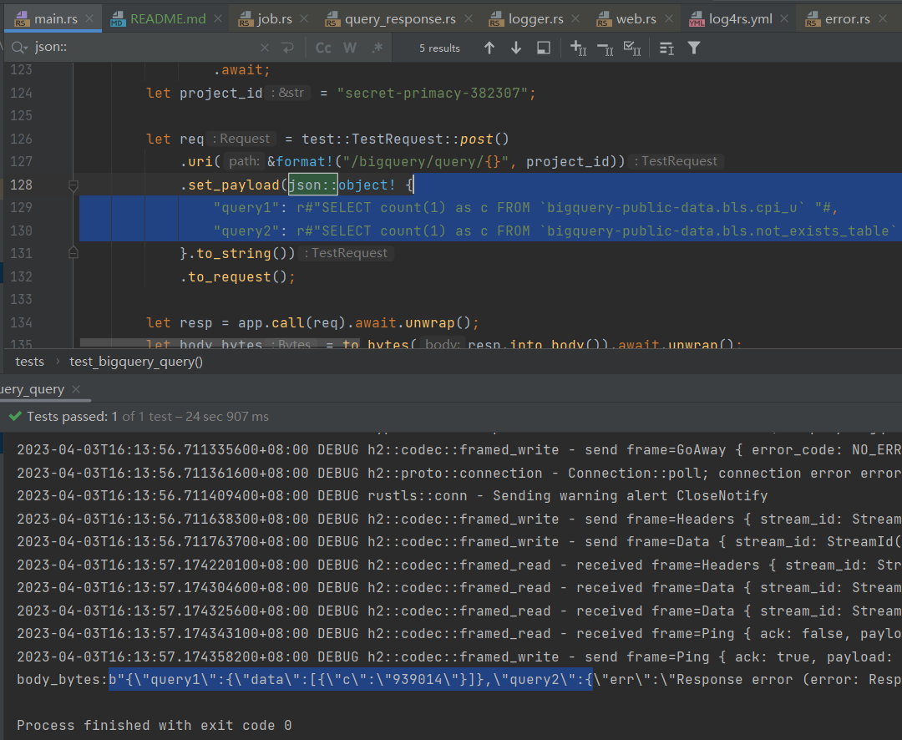

# BigQuery Proxy 

- support CORS 
- support execute multi query concurrence 

query param e.g.  
```json
  {
     "queryName1":"select 1 as c",
     "queryName2":"SELECT count(1) as c FROM `bigquery-public-data.bls.not_exists_table`"
  }
```

response json e.g.

```json
 {
  "queryName1": {
    "data": [{"c": 1}]
  },
  "queryName2": {
    "err": "error message something like table not_exists_table is not exists"
  }
}
```  



