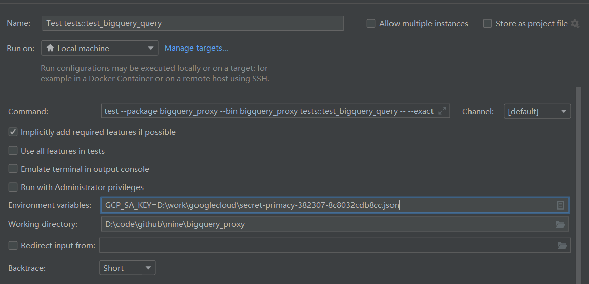
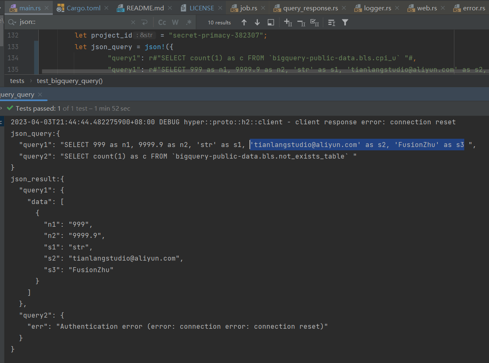

# BigQuery Proxy 

- support CORS 
- support execute multi query concurrence 
- support set google service account key by env GCP_SA_KEY  
  

## How to run 
```bash
    git clone https://github.com/TianLangStudio/bigquery_proxy
    cd bigquery_proxy  
```
set your Google Account Service file path in .cargo/config.toml 
```toml
[env]
# set google service account file path there, you can override it by env if force set false
GCP_SA_KEY = { value = "D:\\your\\google\\service\\account\\key\\there.json", force = false }
``` 


run test 
```bash
cargo test tests::test_bigquery_query 
```
run
```bash
cargo run
```

query param e.g.  
```json
  {
     "queryName1":"select 1 as c",
     "queryName2":"SELECT count(1) as c FROM `bigquery-public-data.bls.not_exists_table`"
  }
```

response json e.g.

```json
 {
  "queryName1": {
    "data": [{"c": 1}]
  },
  "queryName2": {
    "err": "error message something like table not_exists_table is not exists"
  }
}
```  



